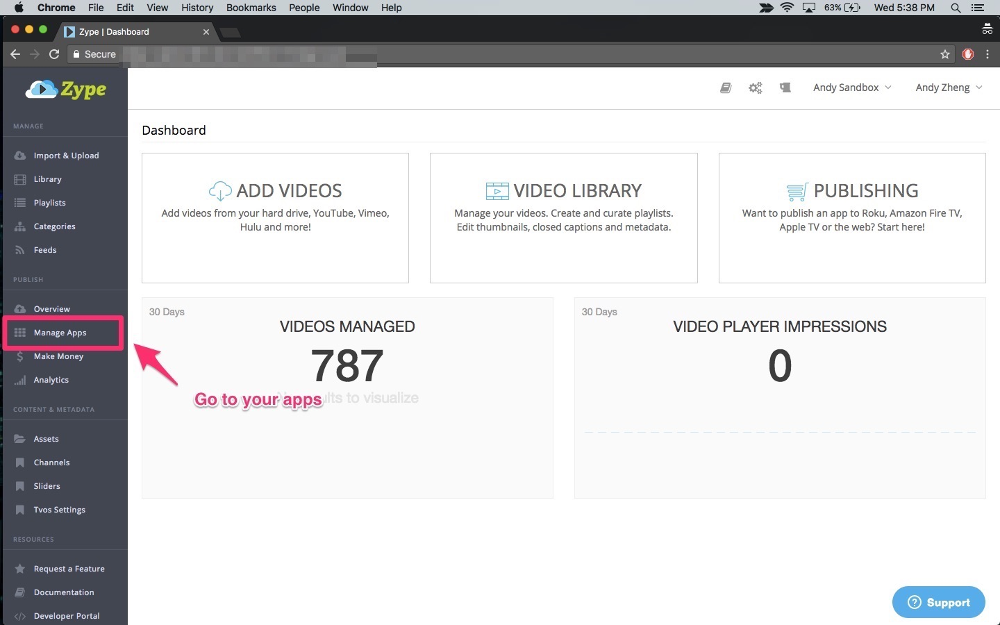
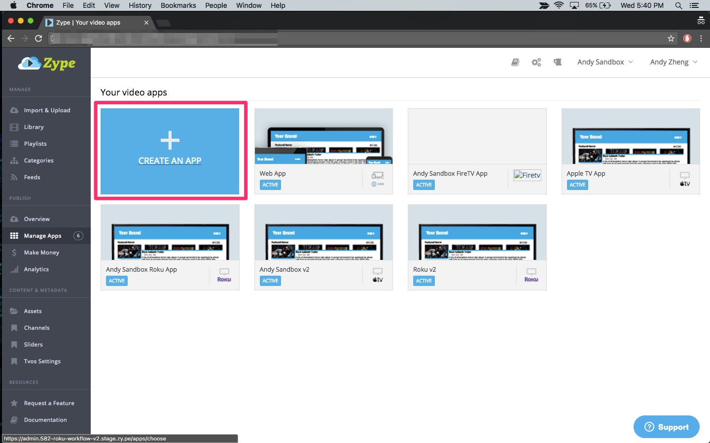
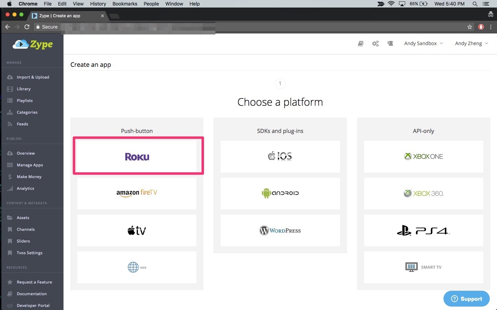
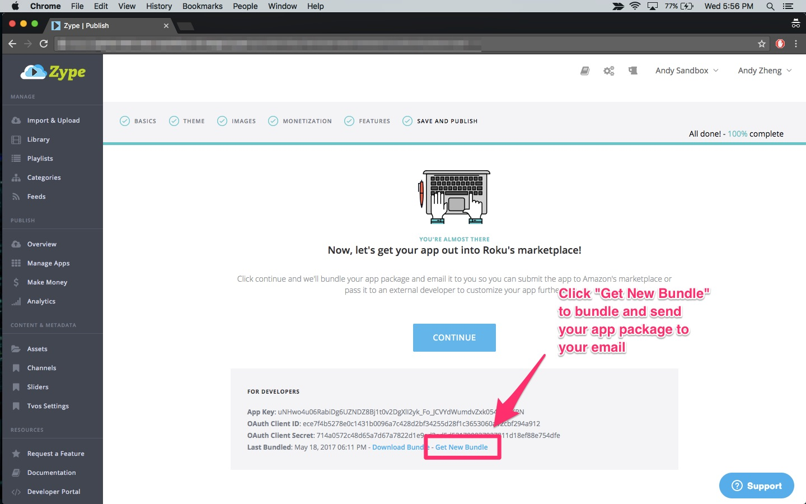
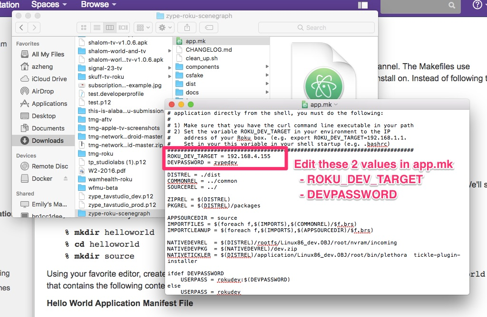
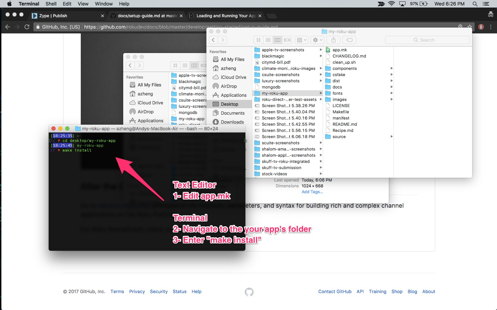
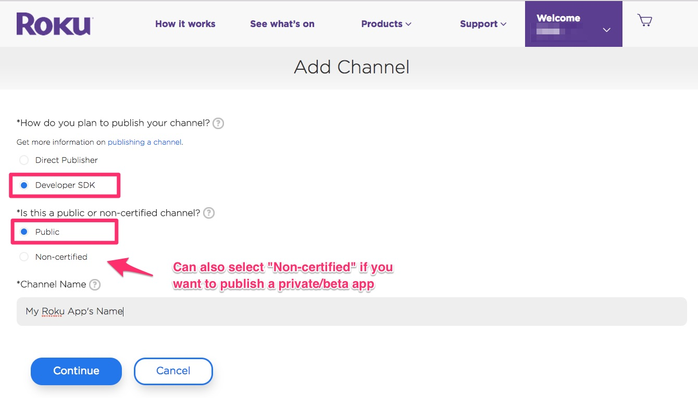
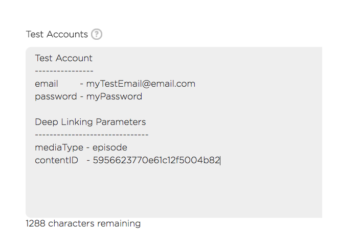

# Zype Roku Recipe

This document outlines step-by-step instructions for creating and publishing a Roku app powered by Zype's Endpoint API service and app production software and SDK template.

## Requirements and Prerequisites

#### Technical Contact

IT or developer support strongly recommended. Creating the final app package requires working with the Terminal to sideload and package the app.

#### Roku Device and Account

In order to package your Roku app, you will need a Roku device. If you use Zype's app production tools, you will get the code for the application; however Roku's process for packaging apps requires that you sideload and package the app on a Roku device before you download the package from the device itself. Because you need a Roku device to sideload the app on, you will also need a Roku account in order to set up the device.

#### Zype Roku Endpoint License

To create a Zype Roku app you need a paid and current Zype account that includes purchase of a valid license for the Zype Roku endpoint API. Learn more about [Zype's Endpoint API Service](http://www.zype.com/services/endpoint-api/).

#### Enrollment in Roku's Developer Program

The Roku Developer Program can be enrolled in via [Roku's developer website](https://developer.roku.com).

## Creating a New App with the SDK template

#### Generate your bundle

1. In order to generate your Roku app using the SDK, you will need to first create the app on the Zype platform. If you have not done this yet, log in to your Zype account [here](https://admin.zype.com/users/sign_in), and click on the __Manage Apps__ link under the Publish menu in the left navigation. You will see a button to create a new app. Continue following the instructions provided within the app production software.

2. Once you have completed the flow to create your Roku app in the Zype platform click on __Get New Bundle__ and the configured app bundle will be emailed to you.

#### Installing and testing your new app

3. Once you have received your new app, you will need to sideload the application in order to test it. First you need to enable [Developer Mode on your Roku device](https://sdkdocs.roku.com/display/sdkdoc/Loading+and+Running+Your+Application#LoadingandRunningYourApplication-EnablingDevelopmentModeonyourbox). There are 2 ways to sideload your app:
  - You can use the Application Installer Page [as explained here ](https://sdkdocs.roku.com/display/sdkdoc/Loading+and+Running+Your+Application#LoadingandRunningYourApplication-ApplicationInstallerPage).
  - You can sideload it from your Terminal by updating the __app.mk__ file. Inside _app.mk_ you should update the __ROKU_DEV_TARGET__ to be your Roku device's IP address and the __DEVPASSWORD__ to be the password you set up when enabling Developer Mode. Once you have saved _app.mk_, you can navigate to your app's folder in the Terminal by entering `cd /path/to/my/app/folder`, then `make install` to sideload your app.

  

  

4. You should QA your app and make sure it passes [this checklist](https://docs.google.com/document/d/1W5yrsOy1m_Se6qzh6-dASv09xElPvb-HUHZe5bchfM0/edit?usp=sharing) before proceeding to submission.
  - __[Guide to testing Deep Linking](docs/testing/TestingDeepLinking.md)__
  - __[Guide to testing Native Subscriptions](docs/testing/TestingNativeSubscriptions.md)__

#### Submitting to the Roku App Store

5. Once you have thoroughly tested and approve your app, you can start packaging your app. It should be noted that if you are submitting an update to an existing Roku app, you need to update the version numbers in the __manifest__ and the __Makefile__, then re-sideload your app. For more information on how to package your app, [see the documentation here](https://sdkdocs.roku.com/display/sdkdoc/Packaging+Roku+Channels#PackagingRokuChannels-PackagingusingthePackageUtilities).
  - Screenshots are not required for Roku apps, but you can also take screenshots of your app by [following the documentation here](https://sdkdocs.roku.com/display/sdkdoc/Developer+Settings#DeveloperSettings-ScreenshotUtility).

###### Creating Native Subscriptions

6. __(Optional)__ If you are using native subscriptions in your app, please [follow the documentation here](docs/submission/CreatingNativeSubscriptions.md).

###### Creating Device Linking Page

7. __(Optional)__ If you are using device linking in your app, you __MUST__ create a device linking page on your website. If you do not have a page for your users to link their device, your app will not pass Roku certification.
  - You can either develop it using [Zype's Device Linking Api](http://dev.zype.com/api_docs/device_linking/) in your site or using [Zype's device linking widgets](https://support.zype.com/hc/en-us/articles/223489448-Subscription-Widgets)

###### Publishing your app

8. After you have packaged your app you can start publishing your app by creating a new channel under your Roku developer account.

  - __STEP 1__ - Determine if you are submitting a PUBLIC or PRIVATE app.
    - PRIVATE
      - Private apps are created by selecting the "Non-certified" option when first creating the app.
      - Private/non-certified apps are hidden from the app store and can only by added with the _access code_ which you set when creating your app.
      - Private apps do not go through Roku's review process and can be published immediately.
      - __NOTE:__ You can first submit your app as private, then have it converted to a public app later. This is a great way to test the full functionality first before having it undergo Roku review. To convert a private app to a public one, you will need to contact Roku at `partnersuccess@roku.com`
    - PUBLIC
      - To create a public app, just select the "public" option when creating your app
      - To submit a public app you will need to complete the following steps to get approved
  - __STEP 2__ - Include a test account with access to all content if you are using universal subscriptions
      - [Creating a test acccount](https://support.zype.com/hc/en-us/articles/115010965107-Creating-a-Consumer)
      - [Use redemption codes to unlock content for test account. Redemption codes can be used for subscriptions and video/playlist purchases](https://support.zype.com/hc/en-us/articles/218358428-Creating-Redemption-Codes)
  - __STEP 3__ - Include deep linking parameters
    - __[ALL PUBLIC APPS must include deep linking parameters when submitting](docs/submission/DeepLinkingSubmission.md)__
  - __STEP 4__ - __Create native subscriptions if needed. This needs to be done BEFORE CLICKING SUBMIT.__
    - [How to create native subscriptions in Roku](https://support.zype.com/hc/en-us/articles/115009092407-Creating-Native-Subscription-in-Roku)

  

  

9. Once submitted Roku will review your app (if it is public) against their submission guidelines. If your app is approved, they will update your app status and you should receive an email notification from Roku informing you that your app is live. You can then search for it on Roku's marketplace under the __Search__ tab.
