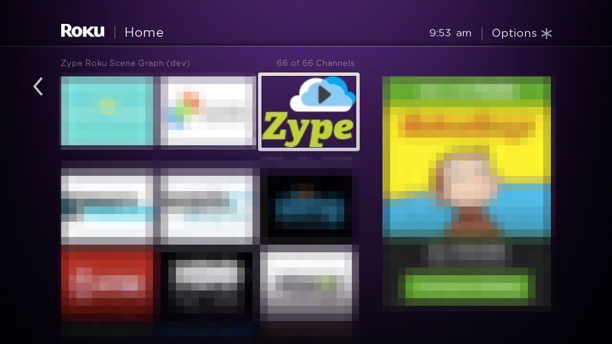
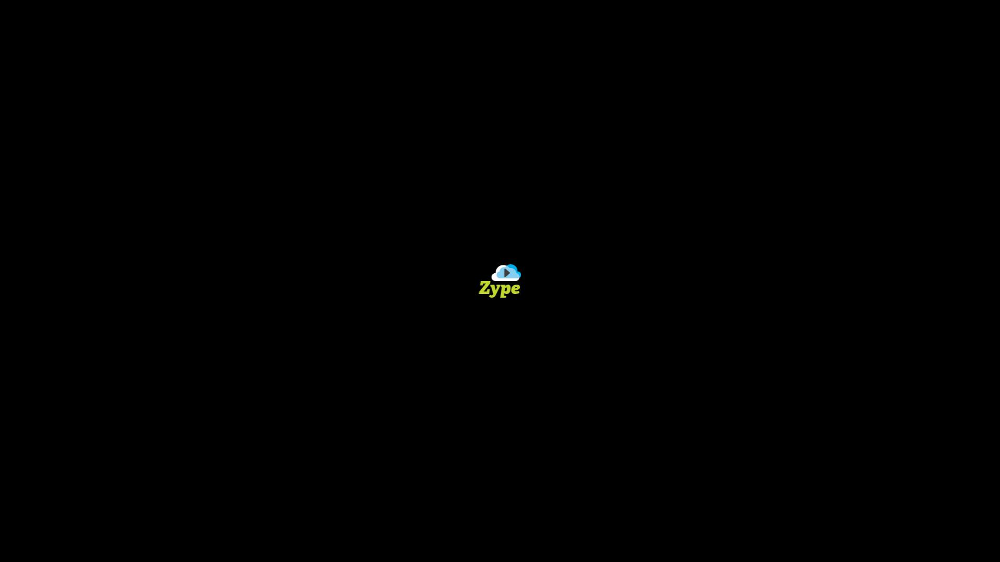
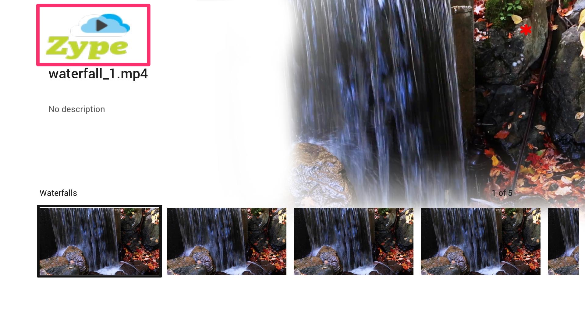
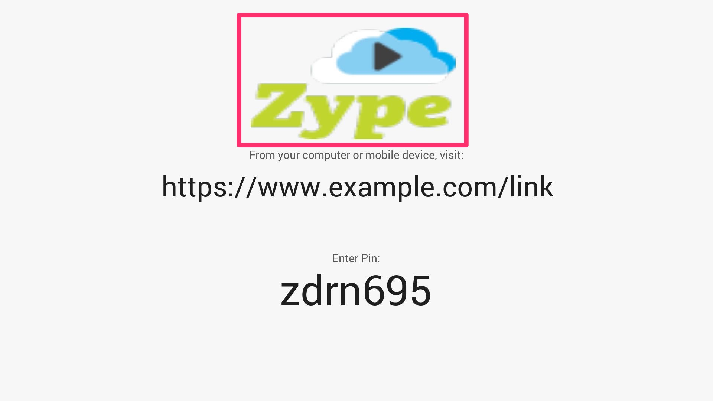

# What Images Do I Need To Update

There are a handful of images that need to be updated when you are starting from scratch. Roku only requires certain assets when submitting. For the up to date info on the required assets, you can reference [Roku's documentation](https://github.com/rokudev/docs/blob/master/develop/specifications/manifest.md).

Inside the _images_ folder, you only need to update the following images:

---

| Image         | Filename          | Description                                                     | Dimensions                        |
|---------------|-------------------|-----------------------------------------------------------------|-----------------------------------|
| App Icon      | app_icon.png | App Icon on Roku menu                                           | 540 x 405                         |
| Splash Screen | splash_image.png | Full screen image  when app first opens                         | 1920 x 1080                       |
| Logo   (Optional,  not Roku specific)         | overhangLogo.png  | Logo used in app on  top-left corner and  device linking screen | W = 375     100 <= H <= 200 |

__Note:__ You do not have to remove any of the existing images inside the _images_ folder. You just need to _replace_ select images with yours by renaming the image and replacing the image that is currently in the folder.

---

### App Icon

This is the icon that will show up on the Roku Home Menu. The image used changes based on the resolution that the Roku's display settings are set as.

### Splash Screen

This is a full screen image that first appears when the Roku app is opened.

### Overhead Logo

This image is used at the top-left corner of the screen in different parts of the app

as well as in the Device Linking screen.

