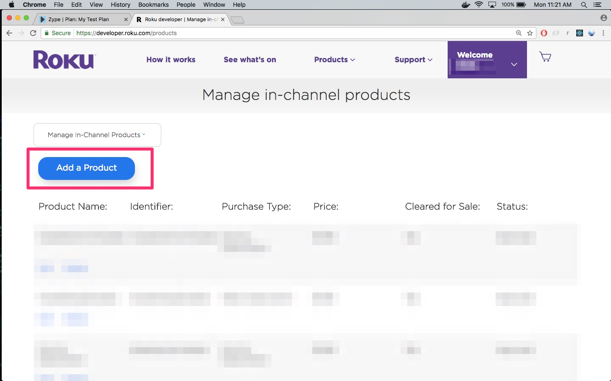
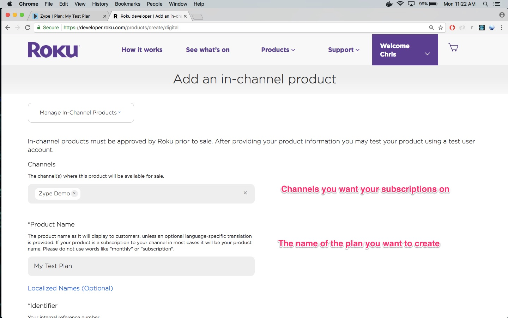
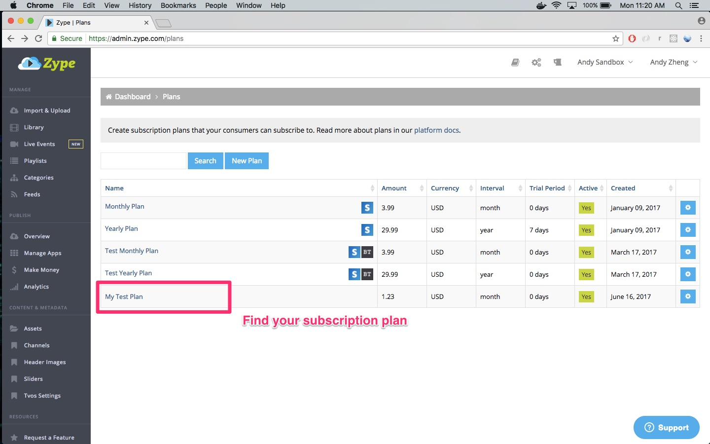
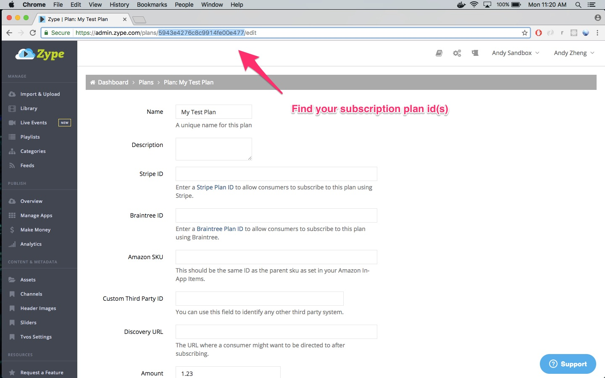
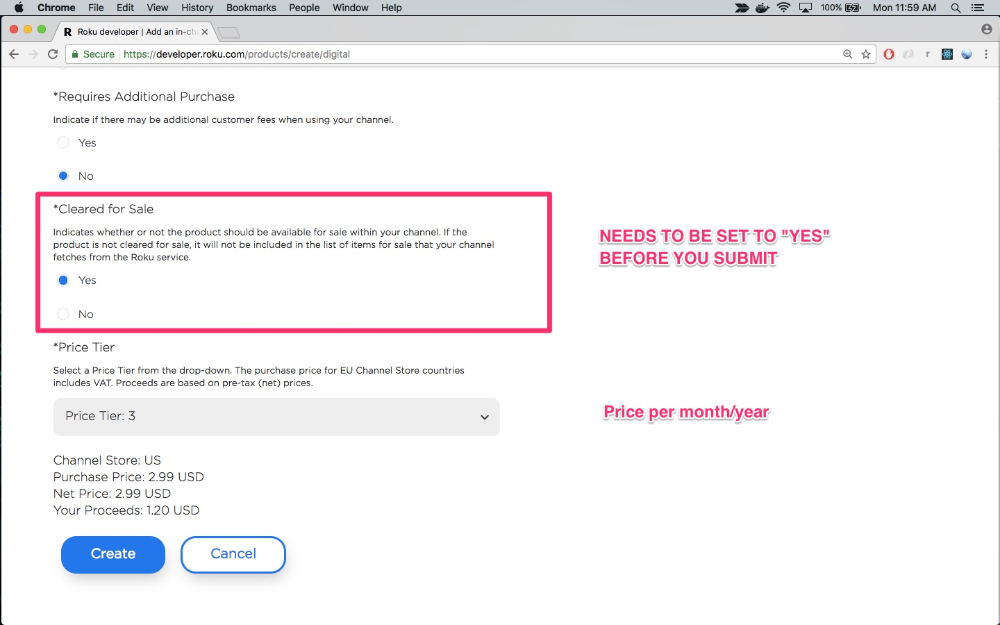

# Creating Native Subscriptions for Roku

#### Prerequisites

Before you create native subscriptions for your Roku app, make sure that you have done the following:

1. Have an existing subscription plan on the Zype platform
2. Be fully enrolled in Roku Billing Services
3. Create your Roku app (app just needs to exist, does not need to be submitted yet)

#### Creating the subscription

Once you have completed the prerequisites you can create your subscription by logging in, then navigating to Roku's developer dashboard and clicking __Manage My In-App Products__.

When creating your native subscriptions, make sure the __Identifier__ matches the id of a subscription plan on the Zype platform.

__Remember to set "Cleared For Sale" as "Yes"__ before you submit. If you try to submit an app with in-channel (native) subscriptions that are not cleared, Roku's testers will get reject the app.

