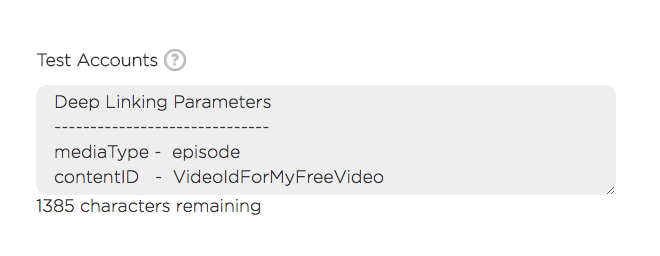
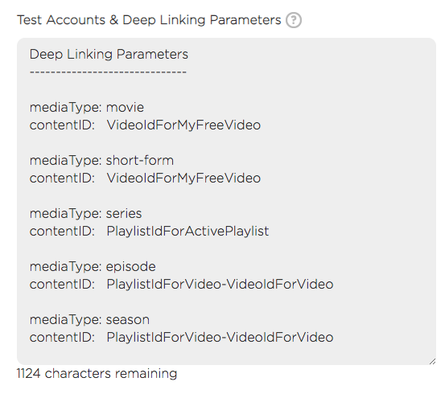

# Submitting Deep Linking Parameters

When submitting your app remember to include parameters for deep linking. If you forget to include them, Roku will reject your app and ask you for them later. You can include these parameters in the __Test Accounts__ text box under the __Support Information__.

### Expected Behavior

With deep linking, the app is supposed to open a video or playlist depending on the parameters provided. If the user is deep linked and entitled to the video (movie, short-form, special, episode), the video should automatically play after the app loads. If the user is deep linked to a playlist (series, season), the app should display all the videos for that series/season.

### Provide the following info

__mediaType__ can be one of the following: movie, short-form, special, series, season, or episode.
- Use _movie_, _short-form_ or _special_ if linking to a video
- Use _series_ if linking to a playlist
- Use _season_ if linking to a playlist with the video pre-selected
- Use _episode_ if linking to a video within a playlist. When the user leaves the video player, the user goes back to the playlist that the video was in

__contentID__ is the id the content that you are linking the user to
- When you provide a __video id__, please provide an id for an __active and playable video__. To avoid complications with submission, it is recommended that you provide an id for a free video. If the app does not link to a playable video, the app will be rejected.
- When providing a __playlist id__, please provide an id for an __active playlist__. If the app does not link to a working playlist, the app will be rejected.
- When using the __season__ or __episode__ mediaType, the contentID should be the playlist id combined with the video id in the following format: __playlistId-videoId__. Note the dash that separates the playlist and video id. The __playlist id__ is the id for the playlist that the video is. The __video id__ is the id for the video that you are linking the user to. Make sure both the playlist and the video are active.
  - The app expects the ids to be provided in this format when linking to a season or episode.
  - When linking to a __season__ the app takes the user directly to the playlist with the video pre-selected.
  - When linking to an __episode__ the app behaves similarly to the __season__ mediaType, except that the app also starts playing the pre-selected video.